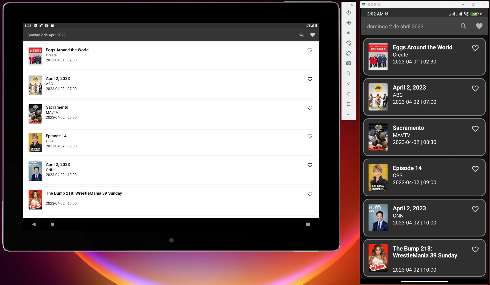
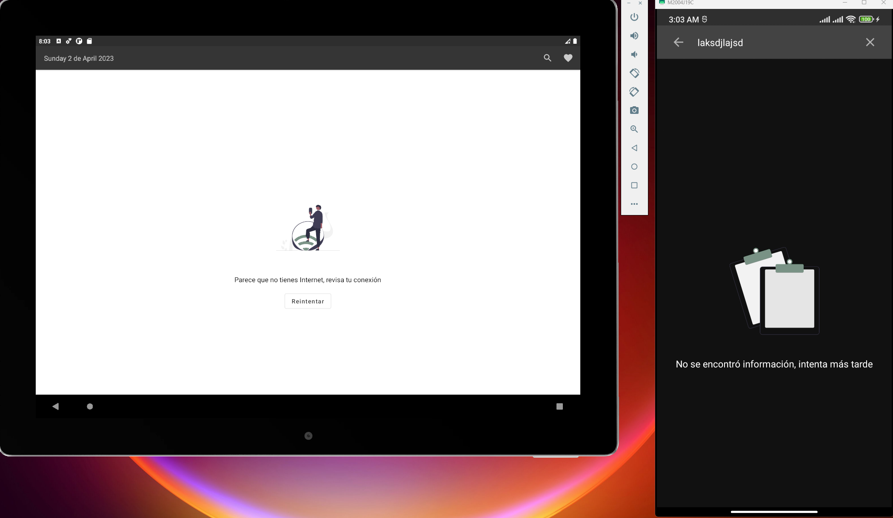
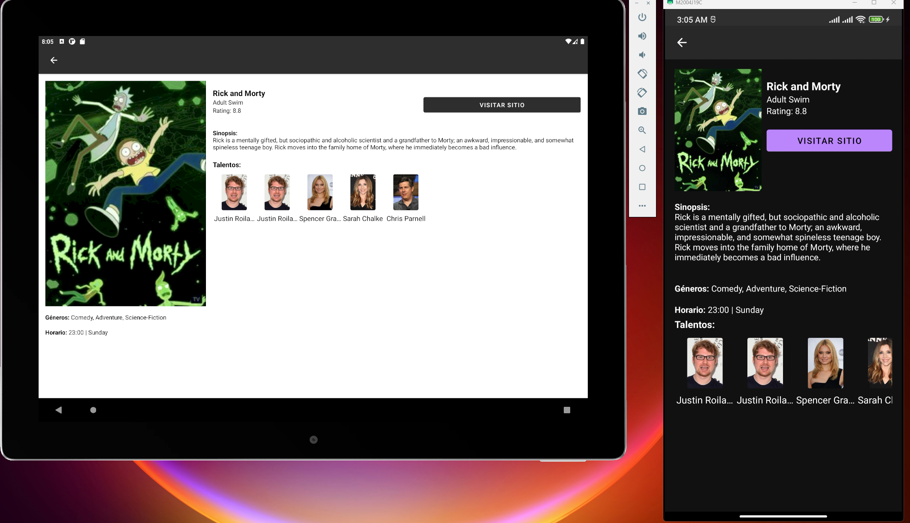
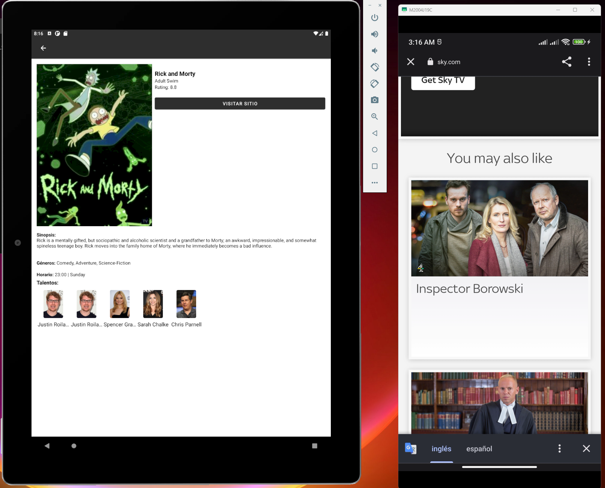
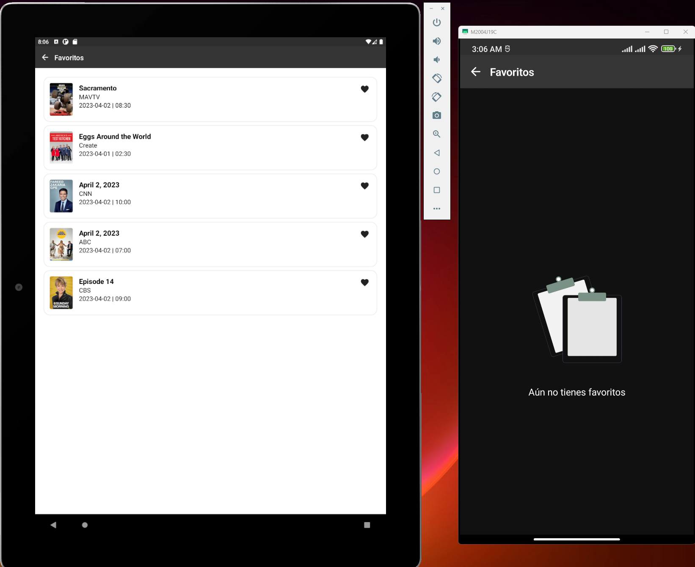

## Resumen
Principales caracteristiscas
- MVVM
- Hibrido entre compose y xml
- Entorno reactivo
- Manejo de validaciones para datos vacios
- Inyeccion de dependencias
- TDD
- Persistencia de datos para favoritos
- Splash screen
- Manejo de orientacion para tablet y mobile
- Pruebas unitarias

### Librerias y versiones
```sh
    //Hilt
    implementation 'com.google.dagger:hilt-android:2.44'
    kapt 'com.google.dagger:hilt-android-compiler:2.44'

    //Room
    implementation "androidx.room:room-runtime:2.5.1"
    implementation "androidx.room:room-ktx:2.5.1"
    kapt "androidx.room:room-compiler:2.5.1"

    // Network
    implementation "com.squareup.okhttp3:okhttp:4.9.0"
    implementation "com.squareup.retrofit2:retrofit:2.9.0"
    implementation "com.squareup.retrofit2:converter-gson:2.9.0"
    implementation "com.google.code.gson:gson:2.9.0"
    implementation 'androidx.browser:browser:1.5.0'

    //Glide
    implementation "com.github.bumptech.glide:glide:4.12.0"
    implementation "com.github.bumptech.glide:okhttp3-integration:4.11.0"
    kapt "com.github.bumptech.glide:compiler:4.12.0"

    //Compose
    implementation "androidx.activity:activity-compose:1.7.0"
    implementation "androidx.compose.ui:ui:1.5.0-alpha01"
    implementation "androidx.compose.material:material:1.5.0-alpha01"
    implementation "androidx.compose.ui:ui-tooling:1.5.0-alpha01"
    implementation "androidx.compose.ui:ui-tooling-preview:1.5.0-alpha01"
    implementation "androidx.compose.animation:animation:1.5.0-alpha01"
    implementation "androidx.lifecycle:lifecycle-viewmodel-compose:2.6.1"
    implementation "io.coil-kt:coil-compose:1.4.0"

    implementation "com.airbnb.android:lottie:4.2.2"
```
## Home (compose) 



## Detalle (xml y compose, chrome custom tabs)



## Favoritos (compose)



